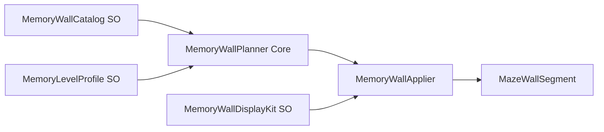

# maze-arena — current structure

**Status:** `maze-arena/` is an existing Unity game sibling under the studio root. **Do not create a new project.** Extend what is here.

**Rules for later prompts:**

- Maze generation, 3D extrusion, wall styles, and photo quads live in shared UPM packages. Game-specific memory catalogs, spawn rules, and HUD stay in `maze-arena/`.
- Extend existing types; do not fork a second maze kernel or locomotion stack.

## Packages used (do not duplicate)

From `maze-arena/Packages/manifest.json`:

| Package | Role |
|---------|------|
| `com.nixin.game.core` | RNG (`XorShiftRandom`), shared service interfaces |
| `com.nixin.grid.core` | `GridCoord`, `GridSize`, grid geometry |
| `com.nixin.maze` | Seeded maze generation, cell/wall ids, 3D arena, wall styles, photo prefab kit — see `packages/com.nixin.maze/README.md` |
| `com.nixin.locomotion` | First-person walk/look (WASD + mouse, dual touch sticks) — see `packages/com.nixin.locomotion/README.md` |
| `com.nixin.boot` | Opted in; not the main play loop |

**Photo walls:** quads + URP materials (`Resources/NixinMaze/Photo`), not sprites. **SVG:** not implemented.

Default maze prefabs: `packages/com.nixin.maze/Runtime/Unity/Resources/NixinMaze/` (wall, floor, ceiling, cell, photo). Generate defaults via **Nixin Studio → Maze → Generate Default Prefabs** in a URP project.

## Game folder map

```text
maze-arena/
  Assets/Game/Core/           # AvatarPose, MazePreset*, Memory planner (no UnityEngine)
  Assets/Game/Unity/          # Boot, HUD, walker, themes, memory SOs + applier
  Assets/Tests/EditMode/
  DotNet/                     # Core unit tests (outside Assets)
```

### Key runtime types

| Type | Path | Role |
|------|------|------|
| `MazeArenaBoot` | `Assets/Game/Unity/MazeArenaBoot.cs` | Finds/creates `MazeArena`, wires memory catalog, HUD, orbit camera, walker; default seed 7 |
| `MazeHud` | `Assets/Game/Unity/MazeHud.cs` | Size, difficulty, seed, wall style; toggles **Memory wall catalog** vs **Plain photo walls**; walk vs orbit |
| `MazeWalker` | `Assets/Game/Unity/MazeWalker.cs` | Thin wrapper over `FirstPersonController`; entry spawn from `Game.Core` |
| `OrbitCameraRig` | `Assets/Game/Unity/OrbitCameraRig.cs` | Orbit camera when not walking |
| `TopDownMazeMapView` | `Assets/Game/Unity/TopDownMazeMapView.cs` | Top-down map overlay |

### Game.Core (plain C#)

- `AvatarPose` — spawn position/rotation at maze entry
- `MazePreset` / `MazePresetCatalog` — HUD preset buttons
- `Memory/` — planner, validator, expander, level spec, catalog snapshots (no `UnityEngine`)

### Game.Unity — memory walls

| Type | Path |
|------|------|
| `MemoryArenaMemory` | `Assets/Game/Unity/Memory/MemoryArenaMemory.cs` |
| `MemoryWallCatalog` | `Assets/Game/Unity/Memory/MemoryWallCatalog.cs` |
| `MemoryLevelProfile` | `Assets/Game/Unity/Memory/MemoryLevelProfile.cs` |
| `MemoryWallDisplayKit` | `Assets/Game/Unity/Memory/MemoryWallDisplayKit.cs` |
| `MemoryWallApplier` | `Assets/Game/Unity/Memory/MemoryWallApplier.cs` |
| `MemoryCatalogFactory` | `Assets/Game/Unity/Memory/MemoryCatalogFactory.cs` |
| `ProceduralSwatch` | `Assets/Game/Unity/Memory/ProceduralSwatch.cs` |

**Flow:**



1. `MazeArena.Rebuild(seed)` builds walls via `com.nixin.maze`.
2. `MemoryArenaMemory.Decorate(seed)` runs `MemoryWallPlanner` (Core) then `MemoryWallApplier` (Unity).
3. When **Memory wall catalog** is on, `MazeArena.PaintPhotos` is false (plain photo painter is skipped).

**Wall faces:** each wall segment has `Photo` (canonical / maze-facing side). Interior walls also get `PhotoOpposite`. Outer walls only have one corridor face. Level profile `decorateOppositeFaces` / HUD **Both wall faces** controls whether the planner fills the opposite side. `oppositeFaceChance` (0–1) can leave some inner faces empty for A/B.

**Display kinds** (`MemoryDisplayKind`):

- `Photo` — framed quad on wall (`FrameVariantId`: plain, frame, glow, etc.)
- `Relief` — albedo + optional normal map via relief material
- `Object3d` — low-poly prefab on the wall photo anchor

**Planner rules** (`MemoryLevelProfile` → `MemoryLevelSpec`):

- `MaxSameEntryPerWalk` — default 1 (no duplicate image on one walk)
- `MaxSameGenrePerWalk` — optional genre cap
- `AvoidPreviousGenres` — reduces reuse of genre groups across regenerates (`MemoryArenaMemory` tracks history)
- Kind weights: `photoWeight`, `reliefWeight`, `object3dWeight`
- `decorateOppositeFaces` — inner walls can carry a different display on each side (default on)
- `oppositeFaceChance` — probability of filling the opposite inner face (default 1)

**Capacity:** `MemoryCatalogExpander` adds generated entry IDs when the catalog is too small for the maze **display slot** count (walls + enabled opposite faces). `ProceduralSwatch` supplies fallback textures for missing images.

**Configure in Editor:** Create → Nixin Studio/Maze Arena → Memory Wall Catalog / Memory Level Profile / Memory Wall Display Kit; assign on `MemoryArenaMemory`. Boot loads authored defaults from `Assets/Resources/Memory/` via `MemoryDefaults` (falls back to `MemoryCatalogFactory` if missing).

**Default authored assets** (regenerate: **Nixin Studio → Maze Arena → Generate Default Memory Assets**):

| Asset | Path |
|-------|------|
| Catalog (26 entries) | `Assets/Resources/Memory/DefaultMemoryCatalog.asset` |
| Level profile | `Assets/Resources/Memory/DefaultMemoryLevel.asset` |
| Display kit (plain/frame/glow + relief mat) | `Assets/Resources/Memory/DefaultMemoryDisplayKit.asset` |
| Photo textures (14) | `Assets/Game/Memory/Textures/Photos/` |
| Relief albedo + normal (6) | `Assets/Game/Memory/Textures/Relief/` |
| Frame prefabs | `Assets/Game/Memory/Prefabs/Frames/` |
| 3D object prefabs (6) | `Assets/Game/Memory/Prefabs/Objects/` |

## Locomotion

Extracted to `com.nixin.locomotion`:

- `Nixin.Locomotion.Core` — `FirstPersonWalk`, `FirstPersonLook`, `VirtualStick`
- `Nixin.Locomotion` — `FirstPersonController`, `DualTouchSticks`

`MazeWalker` composes `FirstPersonController` and keeps maze-specific spawn/camera in the game layer.

## Tests

| Suite | Command / location |
|-------|-------------------|
| Core | `dotnet test maze-arena/DotNet` — planner, presets, avatar spawn |
| EditMode | Unity MCP/CLI — `MazeArenaBuilderTests`, `MazeGeometryTests`, `MazeWalkerTests`, `MemoryWallDisplayTests` |

## Not done yet

Do not assume these exist:

- High-quality photo art (current textures are procedural placeholders; swap PNGs under `Assets/Game/Memory/Textures/`)
- SVG import pipeline
- HUD level-profile cycling
- Full memory-game loop (recall, scoring, multiple walks per session)

---

# Original product brief

The sections below are the original design intent. Much of the maze kernel and memory-wall catalog is already implemented; read **Current structure** above before scaffolding.

## Creation instruction

create a project here named maze-arena. if common packages can be used free to do so for some task.
We will further reused (by cloning it or inside this same project), so this is to create the base of the game for arena construction. 
So i think this well fits in common packages. If you agree you can create a package for this, and a testing project to use the package for visusal outcome.
You may have two package (not advisable by me though),  one of which can be in C# core , then other in unity....but we can keep it one also of unity package... the thing is it might need unity related methods.

## Goal

We should be able to create square maze arena, (Labyrinth)
i will attach a reference image for that.

2d:
 https://encrypted-tbn0.gstatic.com/images?q=tbn:ANd9GcRpvvVo3wkb897jxVVnD_s48onIlO635wOqK6guTrR8zNMRlXB6BOuq0Mg&s=10

3d: https://previews.123rf.com/images/hstrongart/hstrongart1610/hstrongart161001290/65134471-3d-rendering-maze-blank-square-maze-template-labyrinth-for-business-concept-or-education-isolated.jpg


### 2D map creation

So first a algorithm should be created wich can generate 2d grid arena. It will have some arraay type data structure to save the 2d arena. It should be able to create arena of different size and different toughness. Toughness means to go from entry to exit how complecated the path is involving how many different turns and deadends.

### 3D map creation

once 2D map is created, it can be used and extruded in vertical direction to create 3d areana.
Basically we can use 3d cube/box to create the walls for the lines of 2d map. 

### 3D map view and look&feel

we should have option to add multiple variation for the wall. Like we can have different texture (with alpha, bump map, normal map) to give 3d feel. Like creapers , gress, brick, wooden , metalic, etc. We can use to give different physical based shader look, along with texture used.


### Hurdles and game items

we should design the grid map data strucuture and whole implementaton in such a way that any location inside the area should have id. so in code level , with some data strucutte, we can have option to add game items, collectable, hurdles, powers, enemy etc..

With different game levels and toughness and different kind of games build on this system, we should be able to support all those possiblilities.

### Extension

We should also have option to add different seperate images on the wall (texture) , i mean in a wall we can have segments where photo frames are placed or full wall photo is installed in a grid manner. so one long wall will have many photo, one pohoto on one square grid wall..

Basically i want to use it so that i can create a find you way home game in the areana. and these images user can remember while next walk of the journey to home/escape.


## Game idea: Memory photo frame

1.The game will be related to memory game , so make sure you test the photo frame quad correctly. 
On the wall i want to put some recognizaton and memorizable things, so in next walk user can recall his memory with things on wall to find the right path.
So we can place photo frames. 

-One question : should we use sprites as photo frame, or using quad with texture and material is write chose.
We want to be optimized in terms of performace, as well as apk size. so photoe which we use should be lesser size. so suggest which is write path.

**Decision (implemented):** use quads + URP materials, not sprites.

-If advisable i may also go for , svg images to reduce size for some case. We may bbe needing many images to make it ineresting for user, so image size is a concern.

-Give configuratble option, may be using scriptable object, to have photos of different groups and geners.
For differnet level we can use different kinds of photo.
For A/B testing and trying diff things, it should be easiliy plug and playable.

**Decision (implemented):** `MemoryWallCatalog`, `MemoryLevelProfile`, `MemoryWallDisplayKit` ScriptableObjects.


For some i may want not just image, but some items, which should not be too big in size and bloats my apk size.
you can give support of diff types:

1. photo with diff photo frames:
- i want different kind of frames and effect, with the same photos which we have. So may be photo prefab can be many and little complicated, which will take the actual image and place it inside its frame.
So frame can have different border design, some photo can glow inside, some photo may not have frame like border but placed direclty on wall like painting or graffiti.

**Decision (implemented):** `MemoryWallDisplayKit.FramePrefabFor(variantId)` swaps frame prefabs per entry.

2. image with bump/normal texture and shader to give feel of height for some collectables. like watch, decorative items, plants, different kind of lights, switch boards etc.
3. 3d object support , so that we can place 3d item also in some wall. (for decorative items like pots, flower, statue, idols etc) Although we would want to stick with low poly, so that performance and size is not hampered much.

**Decision (implemented):** `MemoryDisplayKind.Relief` and `Object3d` in planner + applier.


b. In different levels of game, we may want to plug and play different combination of photo gener and types of item, As one kind of photo may make user confused in memorizing the path. 
ie. if same photo keeps on coming at many places in the a walk, it will be tougher to memeorized.
So we can mix differnet kind of images/items.
But still we would not like to reveal all the upcoming variation in future level. So desing the grouping and heirerchy accordinly. 
Keep things in scriptable object so that it will be easy to change and try and create variations.

**Decision (implemented):** genre grouping, `MaxSameEntryPerWalk`, enabled genres per level, kind weights.

One more thing, if u things needed and advisable can keep in mind. Suppose in this level we used some decoration and actors images. Then showing similar things in next level can make it tougher to remember the path as it will conflict with the last path.
So may be with some level of game we should use the kinds of display again. not totaly exclusive, there can be overlap, but showing exactly similar group of display/decoration/photo may be tougher for user to memorize.

**Decision (implemented):** `AvoidPreviousGenres` + genre history in `MemoryArenaMemory`.


### How to configure
Create assets via Create → Nixin Studio/Maze Arena/:
Memory Wall Catalog
Memory Level Profile
Memory Wall Display Kit
Assign them on MemoryArenaMemory (or let boot use runtime defaults).
Add frame prefab variants to the Display Kit for different border styles / glow effects.
For relief items, assign a relief material with normal-map support and optional normal textures per entry.

### Optional next steps:
Author real catalog assets (photos, relief normal maps, low-poly 3D props)
Create frame prefab art (plain / framed / glow / graffiti-style)
Add a HUD level picker to cycle level profiles at runtime
SVG import pipeline when you want smaller vector assets